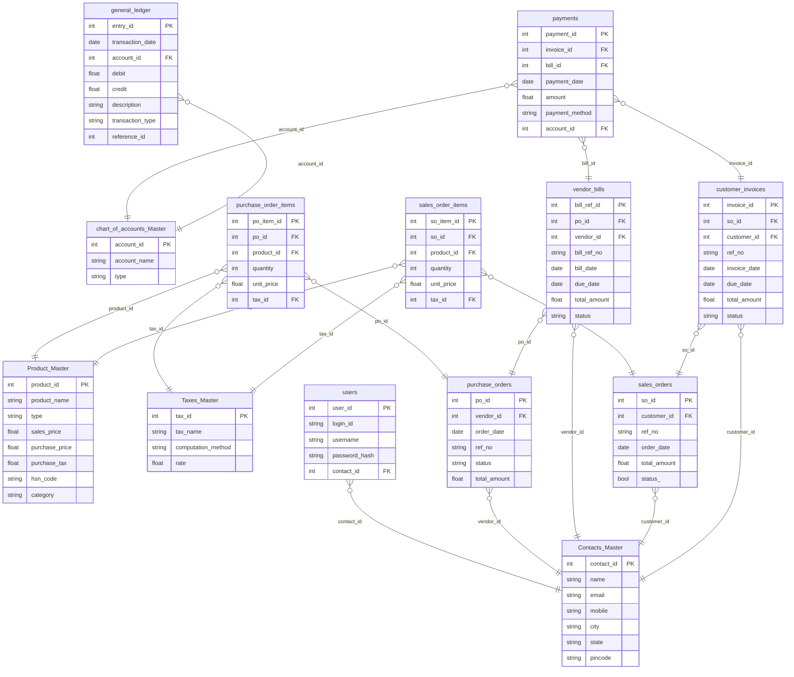

# Odoo - Accounting/ERP System

This project is a comprehensive accounting and ERP system.

- **Backend**: Python with Flask and SQLAlchemy
- **Frontend**: Next.js
- **Features**:
    - User authentication and management
    - Contacts and product management
    - Purchase and sales order management
    - Vendor bills and customer invoices
    - Payments and general ledger
    - Financial reporting (Balance Sheet, P&L)

## Database Schema

