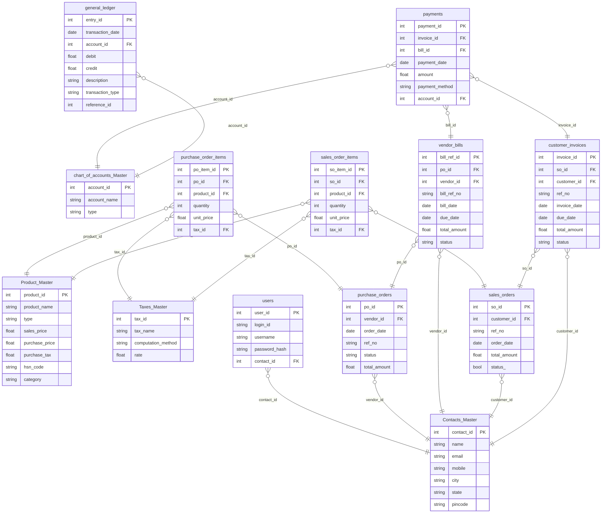

# Odoo - Accounting/ERP System - Backend

This document provides a detailed explanation of the backend for the Odoo - Accounting/ERP System project.

## Backend Logic

The backend is a powerful Flask application that provides a wide range of accounting and ERP functionalities.

- **Flask and SQLAlchemy**: The backend is built with Flask and uses SQLAlchemy for database interaction.
- **Database Schema**: The database schema is extensive and includes tables for:
  - `ContactsMaster`: Stores contact information for customers and vendors.
  - `ProductMaster`: Stores product information.
  - `TaxesMaster`: Stores tax information.
  - `ChartOfAccountsMaster`: Stores the chart of accounts.
  - `User`: Stores user information.
  - `PurchaseOrder` and `PurchaseOrderItem`: Manage purchase orders.
  - `SalesOrder` and `SalesOrderItem`: Manage sales orders.
  - `VendorBill`: Manages vendor bills.
  - `CustomerInvoice`: Manages customer invoices.
  - `Payment`: Manages payments.
  - `GeneralLedger`: Stores all accounting entries.
- **API Endpoints**: The backend provides a comprehensive set of API endpoints for CRUD (Create, Read, Update, Delete) operations on all the database tables.
- **Business Logic**: The backend implements business logic for:
  - Creating and managing purchase and sales orders.
  - Generating vendor bills and customer invoices.
  - Recording payments.
  - Generating financial reports like the Balance Sheet and Profit & Loss statement.

## Database Structure

## API Routes

### Authentication

- `POST /register`: Register a new user.
- `POST /login`: Log in a user and get a JWT token.

### Contacts

- `GET /api/contacts`: Get all contacts.
- `POST /api/contacts`: Create a new contact.

### Products

- `GET /api/products`: Get all products.
- `POST /api/products`: Create a new product.

### Purchase Orders

- `GET /api/purchase-orders`: Get all purchase orders.
- `POST /api/purchase-orders`: Create a new purchase order.
- `GET /api/vendor-bill/<int:po_id>`: Get vendor bill details for a purchase order.

### Taxes

- `GET /api/taxes`: Get all taxes.
- `POST /api/taxes`: Create a new tax.
- `GET /api/taxes/<int:tax_id>`: Get a specific tax.
- `PUT /api/taxes/<int:tax_id>`: Update a tax.
- `DELETE /api/taxes/<int:tax_id>`: Delete a tax.

### Chart of Accounts

- `GET /api/chart-of-accounts`: Get all accounts.
- `POST /api/chart-of-accounts`: Create a new account.
- `GET /api/chart-of-accounts/<int:account_id>`: Get a specific account.
- `PUT /api/chart-of-accounts/<int:account_id>`: Update an account.
- `DELETE /api/chart-of-accounts/<int:account_id>`: Delete an account.

### Sales Orders

- `GET /api/sales-orders`: Get all sales orders.
- `POST /api/sales-orders`: Create a new sales order.
- `GET /api/sales-orders/<int:so_id>`: Get a specific sales order.
- `PUT /api/sales-orders/<int:so_id>`: Update a sales order.
- `DELETE /api/sales-orders/<int:so_id>`: Delete a sales order.

### Vendor Bills

- `GET /api/vendor-bills`: Get all vendor bills.
- `POST /api/vendor-bills`: Create a new vendor bill.
- `GET /api/vendor-bills/<int:bill_ref_id>`: Get a specific vendor bill.
- `PUT /api/vendor-bills/<int:bill_ref_id>`: Update a vendor bill.
- `DELETE /api/vendor-bills/<int:bill_ref_id>`: Delete a vendor bill.

### Customer Invoices

- `GET /api/customer-invoices`: Get all customer invoices.
- `POST /api/customer-invoices`: Create a new customer invoice.
- `GET /api/customer-invoices/<int:invoice_id>`: Get a specific customer invoice.
- `PUT /api/customer-invoices/<int:invoice_id>`: Update a customer invoice.
- `DELETE /api/customer-invoices/<int:invoice_id>`: Delete a customer invoice.

### Payments

- `GET /api/payments`: Get all payments.
- `POST /api/payments`: Create a new payment.
- `GET /api/payments/<int:payment_id>`: Get a specific payment.
- `PUT /api/payments/<int:payment_id>`: Update a payment.
- `DELETE /api/payments/<int:payment_id>`: Delete a payment.

### General Ledger

- `GET /api/general-ledger`: Get all general ledger entries.
- `POST /api/general-ledger`: Create a new general ledger entry.
- `GET /api/general-ledger/<int:entry_id>`: Get a specific general ledger entry.
- `PUT /api/general-ledger/<int:entry_id>`: Update a general ledger entry.
- `DELETE /api/general-ledger/<int:entry_id>`: Delete a general ledger entry.

### Financial Reports

- `GET /api/balance-sheet`: Get the balance sheet.
- `GET /api/pnl`: Get the profit and loss statement.

### Miscellaneous

- `GET /health`: Health check endpoint.
- `GET /api/hsn-codes`: Get a list of HSN codes.
- `GET /api/categories`: Get a list of product categories.
